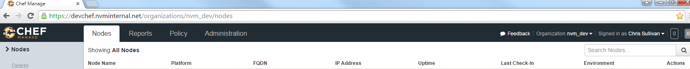
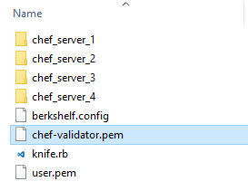
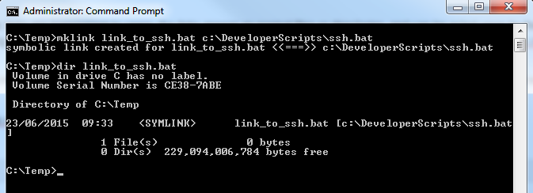
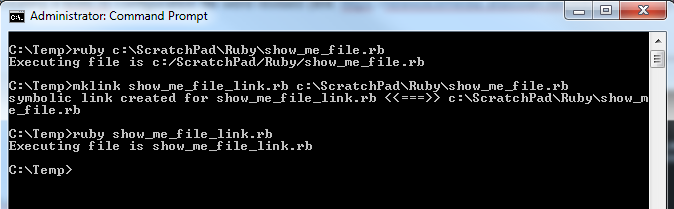
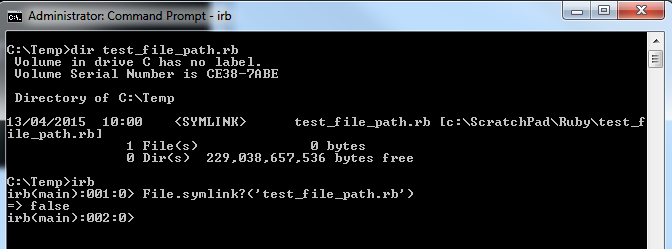
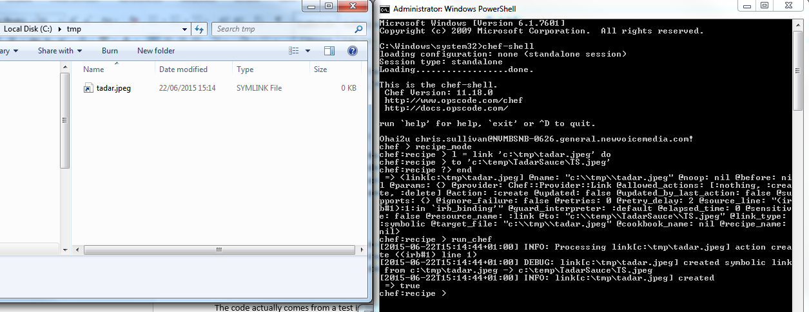
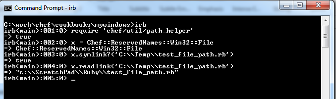

# Knife multiple configuration files

TL;DR You can use a Windows Symbolic Link with Ruby by using the Chef libraries; this will enable you to create short cuts to your multiple knife.rb configuration files.

This code was written way before tools such as knife block plugin, something also to note, the Chef knife.rb is simply a Ruby file so any valid Ruby goes, including reading in environment variables so an alternative solution could be built around the current shell settings (see Many Users, Same Repo).

## Chef - Knife.rb

When developing with Chef there will come a time when you will probably need to interrogate data on the Chef server; you can do this with the Web UI by typing the URL of the Chef server into a web browser, log in and carrying out your business, very convenient and modern.



Unfortunately some Chef commands can only be carried out with a command line tool called knife. The knife command line tool requires basic configuration; the configuration is stored in a Ruby file named knife.rb.

The default location for the knife.rb configuration file is %UserProfile%\.chef folder, on a Windows machine the full path is evaluated to C:\Users\<user name>\.chef.

What if you run multiple Chef servers? Not a problem, the knife command accepts a config (-c) parameter where you can supply the name and/or location of a knife.rb configuration file.

If you manage several Chef Servers you might want to keep your knife configuration files in seperate folder, each folder represents a Chef Server (see below)



To switch between the different Chef servers just pass in the configuration (-c) parameter, it's easy but as I'm a developer I'm lazy* so the less I type the better.

* The three chief virtues of a programmer are: Laziness, Impatience and Hubris - Larry Wall (From the glossary of the first Programming Perl book)

## Windows Symbolic Links

“A symbolic link is a file-system object that points to another file system object. The object being pointed to is called the target. Symbolic links are transparent to users; the links appear as normal files or directories, and can be acted upon by the user or application in exactly the same manner. Symbolic links are designed to aid in migration and application compatibility with UNIX operating systems. Microsoft has implemented its symbolic links to function just like UNIX links.” (source link: https://msdn.microsoft.com/en-us/library/windows/desktop/aa365680%28v=vs.85%29.aspx)

In Windows there are two types of Symbolic Link: hard and soft. Soft symbolic links work essentially the same as a standard shortcut.  When you open a soft link, you will be redirected to the folder where the files are stored.  However, a hard link makes it appear as though the file or folder actually exists at the location of the symbolic link, and your applications won’t know any different.

Rather than go into too much detail about Symbolic links I’ll explain how I used them to allow me to use a much shorter path to my knife.rb configuration files.

First lets look at the content of a typical knife.rb configuration file

```ruby
log_level                :info
log_location             STDOUT
node_name                '<name>'
client_key               'C:/Users/<user name>/.chef/<user name>.pem'
validation_client_name   'chef-validator'
validation_key           'C:/Users/<user name>/.chef/chef-validator.pem'
chef_server_url          'https://<url to chef server>'
syntax_check_cache_path  'C:/Users/<user name>/.chef/syntax_check_cache'
```

As you can see the knife.rb above uses full paths to locations of additional files such as validation_key, this is significant as it makes Symbolic link to the files easy to setup, simply create a link with the mklink command



Recently the instructions for setting up users on the Chef server and creating a knife.rb configuration file were revised (link: https://newvoicemedia.atlassian.net/wiki/display/DW/Setting+up+your+Chef+User+Account), the new instructions come with a new format for the knife.rb configuration file (see below)

```ruby
current_dir = File.dirname(__FILE__)
log_level                :info
log_location             STDOUT
node_name                '<name>'
client_key               "#{current_dir}/<user name>.pem"
validation_client_name   "chef-validator"
validation_key           "#{current_dir}/<validator name>.pem"
chef_server_url          "https://<url to chef server>"
```

Instead of having full file paths we use the Ruby __FILE__ global variable to extract out the working directory and assume all files will be in the same location as the knife.rb configuration file; in Ruby __FILE__ is the full path to the currently executing file.

When using Windows Symbolic links the Ruby __FILE__ global variable value is the name and path of the symbolic link, this can be proved very easily by creating a Ruby program that outputs the __FILE__ variable, then executing the program directly and executing the file via a Windows Symbolic link.

Create a file called show_me_the_file.rb (content below)

```ruby
puts "Executing file is #{__FILE__}"
```

Run the file, then create a symbolic link to the file and run the symbolicly linked file



The result is that the value of __FILE__ when running the code against the linked file is the name linked file, no good for us, we want the value of __FILE__ in our knife.rb file to be the destination file not the linked file.

## Windows Symbolic Link Support in Ruby

Ruby has built in support for symbolic links as part of the File class.

The methods in the File class allow the developer to interrogate a file to see if it is a symbolic link (link: http://ruby-doc.org/core-2.2.0/File.html#method-c-symlink-3F) and read the destination file (link: http://ruby-doc.org/core-2.2.0/File.html#method-c-readlink).

However when we test this functionality in Windows with a simple program we get the following



So, the Ruby File.symlink? method returns false for our symlinked file.

Digging deeper, there is no out of the box support for Windows symbolic links; Ruby developers wishing to write cross platform code normally add a method to determine whether symbolic link support is available for the operating system

```ruby
# Does the O/S have symlink support (in Ruby)
def check_have_symlink?
  File.symlink nil, nil
rescue NotImplementedError
  return false
rescue
  return true
end
```

The code above actually comes from a test in the Ruby source code (link: https://github.com/ruby/ruby/blob/trunk/test/fileutils/test_fileutils.rb#L51)

## Win32-symlink
Running a quick internet search for Windows symbolic link support in Ruby doesn’t throw up much but there are some supporting libraries such as Win32-symlink (link: https://rubygems.org/gems/win32-symlink/versions/0.1.3) but unfortunately this Gem produces errors while being installed with a failure to compile native extensions; although there are some work around solutions for this. Having looked at the source code of Win32-symlink it appears that the only way to obtain details of a linked file is to use the Win32 libraries by opening the link and interrogate it (as described by Raymond Chen here: http://blogs.msdn.com/b/oldnewthing/archive/2010/02/12/9962359.aspx there are other articles that flesh this out with a little more detail).

In my eagerness to search for an answer I had failed to notice that the excellent Chef automation tool has a resource for creating and deleting symbolic links. The question is, does the Chef link resource work on Windows? The documentation (link: https://docs.chef.io/resource_link.html) implies the resource does work on Windows and a quick test with Chef-Shell proves that.



On the left Windows explorer showing the Chef link resource has worked. On the right Chef-Shell in standalone mode, single resource created and Chef run invoked.

## Chef Support for Symbolic Links

Knowing that Chef happily supports creating and deleting of Symbolic links on Windows I trawl the source code; it’s actually not that too difficult to find as Chef (IMO) is quite well written.

The code is uses similar calls to the Win32-symlink Gem so how do we cross the divide from Ruby code to Windows API without writing our own gem in C or C++? 

The answer is with a clever library called FFI.

## FFI

Rather than describe the FFI library I’ll use the following extract from Wikipedia:
"libffi is a foreign function interface library. It provides a C programming language interface for calling natively compiled functions given information about the target function at run time instead of compile time. It also implements the opposite functionality: libffi can produce a pointer to a function that can accept and decode any combination of arguments defined at run time.

libffi is most often used as a bridging technology between compiled and interpreted language implementations. libffi may also be used to implement plug-ins, where the plug-in's function signatures are not known at the time of creating the host application."

Using the Ruby FFI library is reasonably easy, the trivial example below (GetMyPID) took around half an hour to write after read the appropriate documentation.

```ruby
require "ffi"
 
module Win
  extend FFI::Library
  ffi_lib 'kernel32'
  ffi_convention :stdcall
 
 
  # DWORD WINAPI GetCurrentProcessId
  attach_function :GetCurrentProcessId, [], :uint
end
 
puts "Current process Id is #{Win.GetCurrentProcessId}"
```

Rather than distilling the Symlink code in the Chef source and pulling it out into a separate library I can use it directly in my knife.rb configuration file but it's still nice to know what's happening behind the scenes and have multiple options available when coming up with solutions to problems.

## Using Chef Libraries

If you have Chef Client or Chef Developer Kit (ChefDK) then you’ll also have Ruby, compatible Ruby gems and the Chef libraries. If you want access to practically all of the Chef libraries then simply include ‘chef’ in your source code; for the purposes of having access to Symlinks I’m just going to load the libraries that I want.

First thing to do is write a simply write program to test the code and make sure you are pulling in the correct libraries (using IRB but you can also use Pry, see below).



So if we want to use Windows symbolic links to point to our knife.rb configuration file we can alter the knife file as follows

```ruby
require 'chef/util/path_helper'
require 'chef/win32/file'
chef_file = Chef::ReservedNames::Win32::File
current_dir = File.dirname(chef_file.symlink?(__FILE__) ? chef_file.readlink(__FILE__) : __FILE__)
log_level                :info
log_location             STDOUT
node_name                '<name>'
client_key               "#{current_dir}/<user name>.pem"
validation_client_name   "chef-validator"
validation_key           "#{current_dir}/chef-validator.pem"
chef_server_url          "https:://<url to chef server>"
```

## Many Users, Same Repo

Investigating the FFI functionality in Chef is fun but there are alternatives to switching Chef users and Servers, the most common is using environment variables.

The following is taken from https://docs.chef.io/config_rb_knife.html

It is possible for multiple users to access the Chef server using the same knife.rb file. (A user can even access multiple organizations if, for example, each instance of the chef-repo contained the same copy of the knife.rb file.) This can be done by adding the knife.rb file to the chef-repo, and then using environment variables to handle the user-specific credential details and/or sensitive values. For example:

```ruby
current_dir = File.dirname(__FILE__)
  user = ENV['OPSCODE_USER'] || ENV['USER']
  node_name                user
  client_key               "#{ENV['HOME']}/chef-repo/.chef/#{user}.pem"
  validation_client_name   "#{ENV['ORGNAME']}-validator"
  validation_key           "#{ENV['HOME']}/chef-repo/.chef/#{ENV['ORGNAME']}-validator.pem"
  chef_server_url          "https://api.opscode.com/organizations/#{ENV['ORGNAME']}"
  syntax_check_cache_path  "#{ENV['HOME']}/chef-repo/.chef/syntax_check_cache"
  cookbook_path            ["#{current_dir}/../cookbooks"]
  cookbook_copyright       "Your Company, Inc."
  cookbook_license         "apachev2"
  cookbook_email           "cookbooks@yourcompany.com"

  # Amazon AWS
  knife[:aws_access_key_id] = ENV['AWS_ACCESS_KEY_ID']
  knife[:aws_secret_access_key] = ENV['AWS_SECRET_ACCESS_KEY']

  # Rackspace Cloud
  knife[:rackspace_api_username] = ENV['RACKSPACE_USERNAME']
  knife[:rackspace_api_key] = ENV['RACKSPACE_API_KEY']
```

## Summary

Chef is a multi platform development environment and the developers behind the product are trying their hardest to smooth the enormous differences between Windows and Linux with their excellent DSL, even going to far as to negate some of the differences that appear in the platform specific versions of Ruby.

Chef you are awesome!
